

  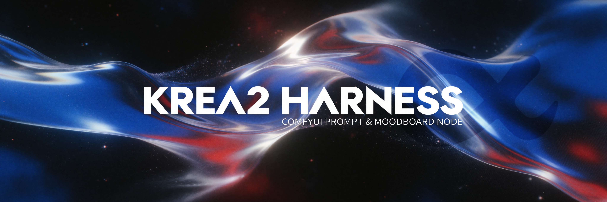

  
  
  
  

English · <a href="README.zh.md">简体中文</a>

# ComfyUI-Krea2-Harness

**ComfyUI-Krea2-Harness** is an early experimental validation project for my research and practice in System Prompt Evolution (SPE) and related Evolution techniques. I packaged the validated results as custom nodes for ComfyUI.

> <small>In this line of experimentation, the system prompt used to generate the main prompt went through 262 versions; I selected version 257. The system prompt used to process emotion words went through 133 versions; I selected version 127 for revision.</small>
>
> <small>I do not provide materials about my SPE and Evolution research, related technologies, or evolution methods here; this research is still at an early stage. If you are working in rare-disease research—for example, using large language models to study human genetics—and have a related need, please feel free to contact me.</small>

In Krea2 Harness, a short prompt, a moodboard style you like, and an aesthetic LoRA can spark unlimited creativity. You do not need to worry about whether prompts from other agents align with the model; just enter your prompt. It handles both simple and detailed prompts.

> <small>Based on the generated results, SPE and Harness continue to expand the capability boundaries of CLIP models. Through evolution, a CLIP model naturally gains the ability to reduce refusals (please use it in compliance with local laws). It is fast, with the inference speed of a native 4B LLM, and can handle tasks performed by larger models. Its one limitation is background-scene refinement, a clear model capability boundary. I leave this open without over-specifying it, for you or your Agent to fill in with detail.</small>

### What Is Evolution?

I could explain and formally define what Evolution means here. Put plainly, any iteration or optimization on the input side of a large model—before the input reaches QKV and FFN—can broadly be called Evolution. Its counterparts are model training and capability alignment.

[Image Generation Showcase](#image-generation-showcase) · [Moodboard Tests](#moodboard-tests) · [Plugin Processing Structure](#plugin-processing-structure) · [Workflow Structure](#workflow-structure) · [Quick Start](#quick-start) · [Node Reference](#node-reference) · [Example Workflows](#example-workflows)

- **Current version:** 0.1.0a1 (V0.1 Alpha)
- **Node category:** Nodes → ANe5s Nodes → Krea2
- **Runtime dependencies:** No additional Python dependencies
- **Moodboard browser:** Example workflows require [ComfyUI-Krea-Moodboards](https://github.com/Andro-Meta/ComfyUI-Krea-Moodboards) to be installed separately

## Image Generation Showcase

### Abstract Blue–Silver Light Beam · Cover · M87 LoRA, realism\_engine\_krea2\_v3.1 LoRA

**Prompt:** An abstract light beam winds horizontally across the center of the frame, with a fluid sense of motion; concept art. (Analog Cobalt Nocturne moodboard selected.) This result is used as the cover.

| Generated Result 1 | Generated Result 2 |
| --- | --- |
| 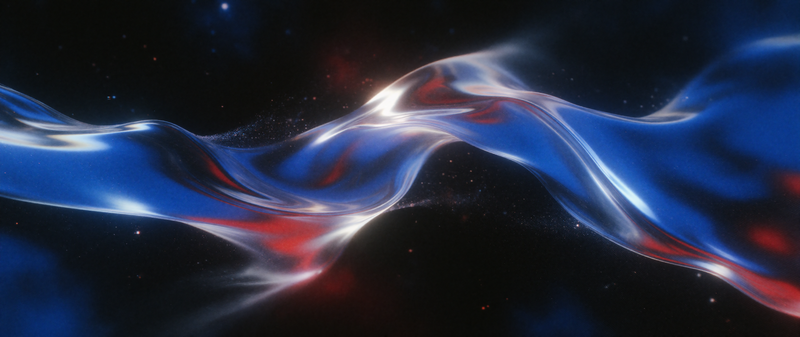 |  |

Show more prompts and generated images

### Ancient Chinese-Style Female Portrait · M87 LoRA

**Prompt:** An 18-year-old woman in traditional Chinese attire, with a cool, minimalist aesthetic and an innocent yet subtly sensual face, smiles at the camera. She lifts her sleeve as it moves in the wind. Portrait photography, low-angle shot. (Cinematic Nocturnal Noir moodboard selected.)

| M87 LoRA 0.8 | M87 LoRA 1.0 |
| --- | --- |
|  |  |

### White-Robed Xianxia Swordswoman · M87 LoRA, realism\_engine\_krea2\_v3.1 LoRA

**Prompt:** A white-robed swordswoman in a Chinese fantasy setting performs a sword dance, with her clothes and hair flowing in the wind. Extreme low-angle view.

| Generated Result 1 | Generated Result 2 |
| --- | --- |
|  |  |

### Cyberpunk Motorcycle Chase · M87 LoRA, realism\_engine\_krea2\_v3.1 LoRA

**Prompt:** An Asian woman rides a motorcycle through a cyberpunk city. As she overtakes a car on her left, she looks back and laughs; a vehicle explodes in the distance. Painterly comic-book style, intricate brushwork, fisheye ultra-wide angle. (Dynamic Ink Fantasy moodboard selected.)

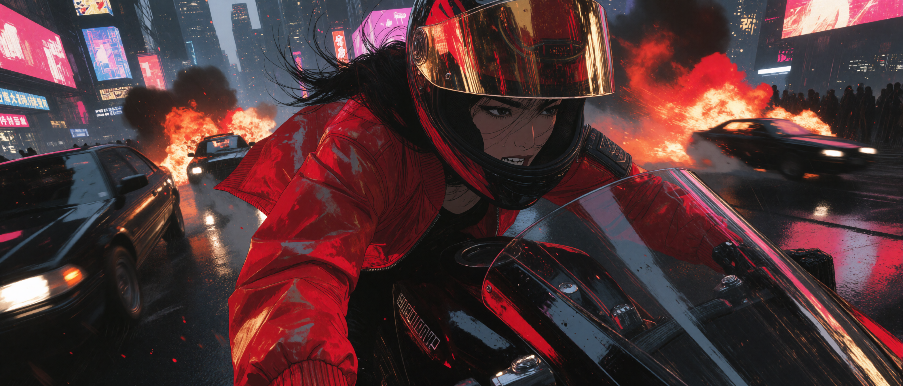

### Four-Panel Storyboard · M87 LoRA

**Prompt:** A beautiful 18-year-old woman in traditional Chinese attire, with a cool, minimalist look and a softly sensual face, smiles at the camera as she lifts her sleeve in the wind. Portrait photography, low-angle shot.

Generate a four-panel storyboard grid with the same aspect ratio in all panels. Show the same person in a continuous space from different angles. The four quadrants tell a continuous story through an establishing long shot of the world, a full-body shot, a medium shot, and a close-up.

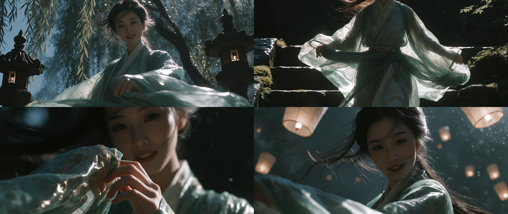

### Cinematic Interior Illustration · Moodboard Style Tests · M87 LoRA, realism\_engine\_krea2\_v3.1 LoRA

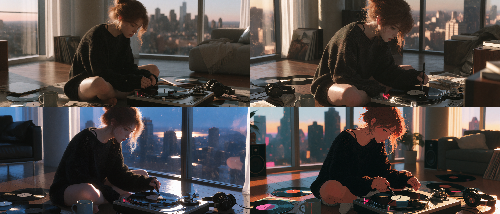

## Moodboard Tests

This section compares ComfyUI Native, Moodboards T2I, and Krea2 Harness using the same image model and sampling settings. Test 3 adds workflow D to observe what happens when the native workflow's expanded prompt is sent to Moodboards.

**Comparison workflows**

- **A · ComfyUI Native:** Native ComfyUI Krea-2 Int8 text-to-image workflow.
- **B · Moodboards T2I:** `krea2_visual_moodboard_t2i` from ComfyUI-Krea-Moodboards.
- **C · Krea2 Harness:** The default text-to-image workflow provided by Krea2 Harness (workflow name: `krea2_harness_文生图默认`).
- **D · B Moodboards + A Native Expansion:** Used only in Test 3; sends the expanded prompt from workflow A into workflow B.

**Unified settings:** Krea-2 Turbo Int8, `qwen3vl_4b_bf16`, `qwen_image_vae`, Euler / simple, CFG 1.0, 10 steps, image seed 424242. The LLM sampler seed is 424242 for A and C; D uses the expansion text generated by A with the same seed. B has no LLM sampler during image generation. The two image sizes are 1568 × 672 and 1376 × 768.

Moodboard styles: **Cinematic Nocturnal Noir — Emerald Wet Canvas** for Tests 1 and 2, and **Analog Cobalt Nocturne** for Test 3. A does not use a moodboard.

### Test 1 · Short Prompt: Creativity and Expansion

**Input prompt:** A library floating on the sea.  
**Moodboard:** B and C use Cinematic Nocturnal Noir — Emerald Wet Canvas.

**Resolution: 1568 × 672**

| A · ComfyUI Native | B · Moodboards T2I | C · Krea2 Harness |
| --- | --- | --- |
| 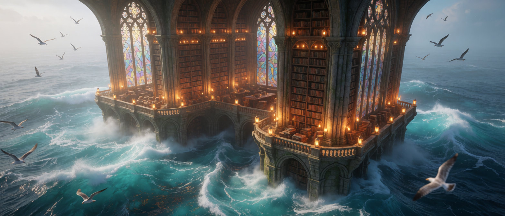 | 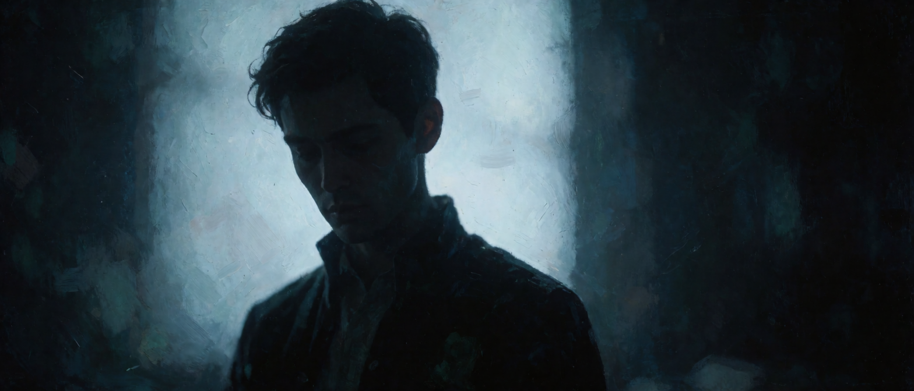 |  |

**Resolution: 1376 × 768**

| A · ComfyUI Native | B · Moodboards T2I | C · Krea2 Harness |
| --- | --- | --- |
| 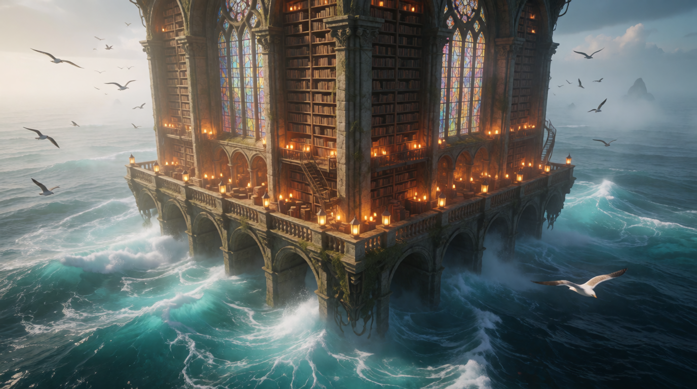 | 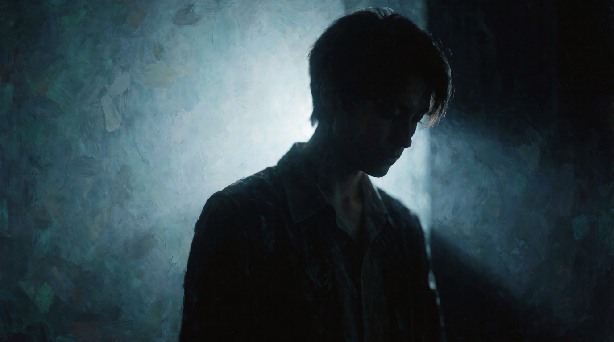 |  |

A and C both generated a library on the sea; C also introduced cool teal tones and a wet texture. B has a dark, cool-toned look, but its main subject is a close-up portrait of a man rather than a library.

### Test 2 · Detailed Prompt: Information Retention and Incorrect Changes

A, B, and C use the same detailed prompt. B and C use Cinematic Nocturnal Noir — Emerald Wet Canvas.

Show the detailed prompt

> A wide documentary photograph shows a small red wooden rowboat traveling from left to right across a calm alpine lake at dawn. The bow points right and the stern is on the left. Exactly one adult woman in a mustard-yellow raincoat sits at the stern, facing right toward the bow, and paddles with one wooden oar on the camera-facing side. A black dog sits at the bow, facing right. One folded white paper map lies on the middle bench between them. A single dark pine-covered island is centered on the horizon behind the boat. Keep the boat in the lower-right third; water fills the lower half and pale violet sky fills the upper half. No buildings, other boats, or text.

**Resolution: 1568 × 672**

| A · ComfyUI Native | B · Moodboards T2I | C · Krea2 Harness |
| --- | --- | --- |
| 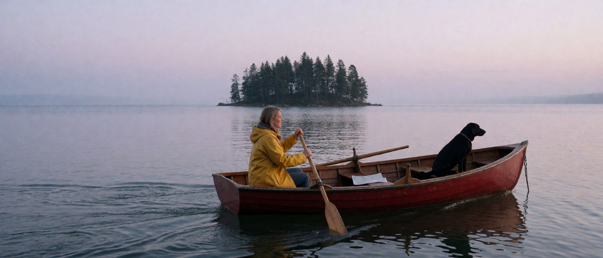 | 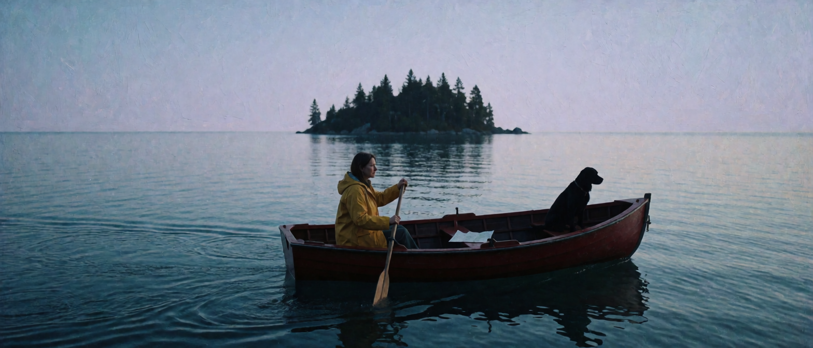 | 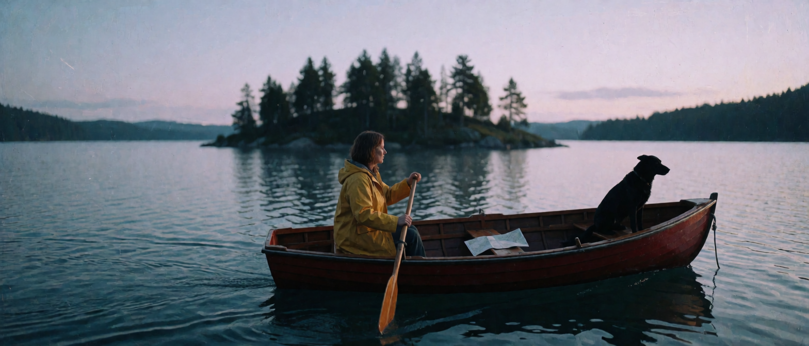 |

**Resolution: 1376 × 768**

| A · ComfyUI Native | B · Moodboards T2I | C · Krea2 Harness |
| --- | --- | --- |
| 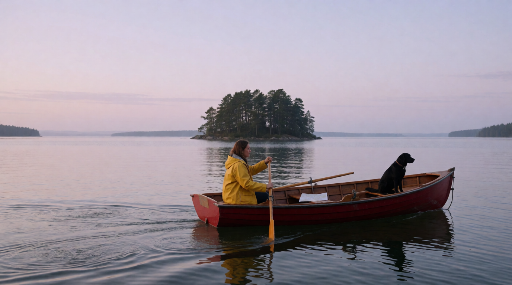 | 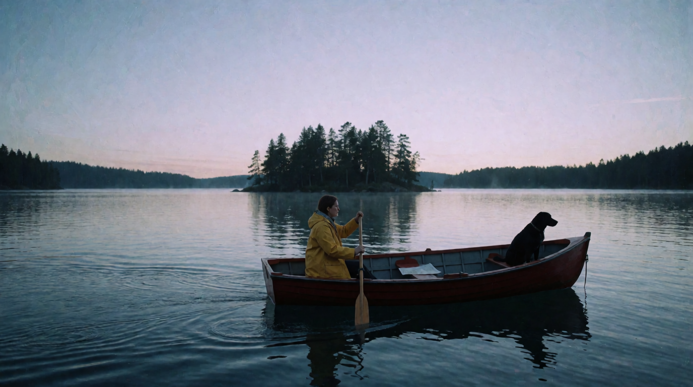 | 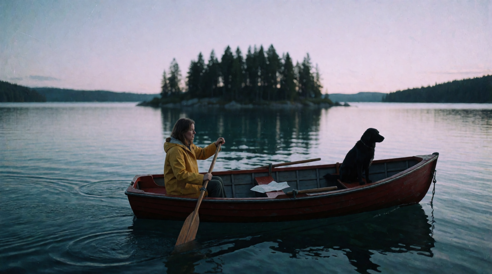 |

All six images retain the red wooden boat, the woman in a yellow raincoat, the black dog, the folded map, the pine-covered island, and the dawn lake. None adds another boat, a building, or text. The requested placement of the boat in the lower-right third is not followed precisely in every image.

### Test 3 · Moodboards | Moodboard Effectiveness

**Starting prompt:** A red bicycle rests against a wall.  
**Moodboard:** B, C, and D use Analog Cobalt Nocturne. A does not use a moodboard.

**Resolution: 1568 × 672**

| A · ComfyUI Native | B · Moodboards T2I | C · Krea2 Harness | D · B Moodboards + A Expansion |
| --- | --- | --- | --- |
| 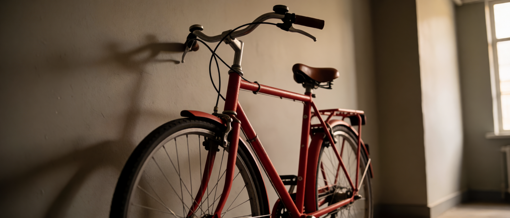 | 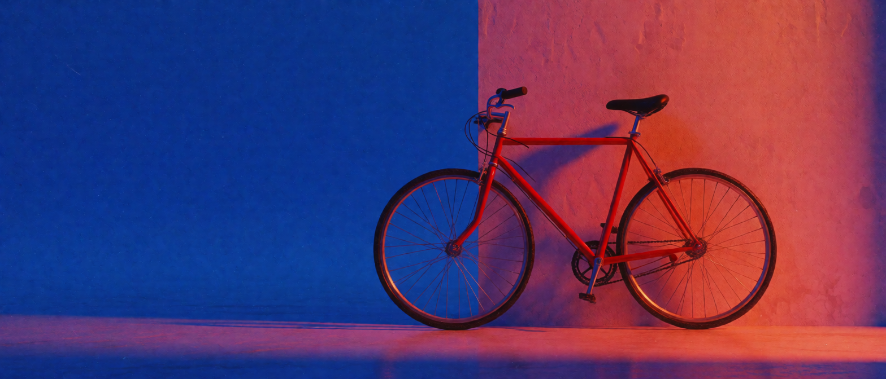 | 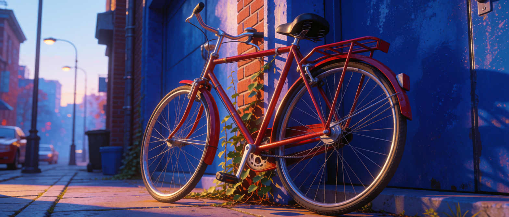 | 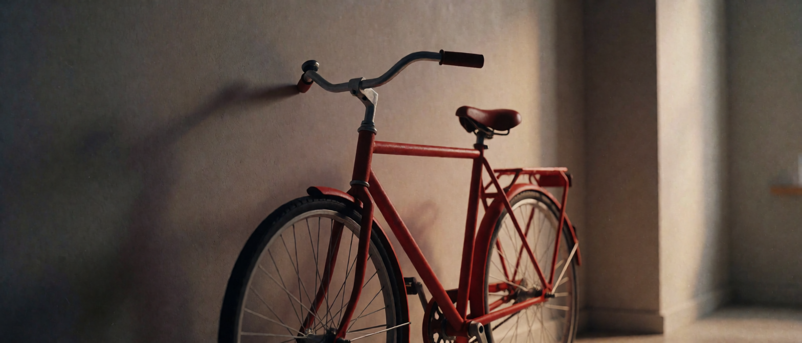 |

**Resolution: 1376 × 768**

| A · ComfyUI Native | B · Moodboards T2I | C · Krea2 Harness | D · B Moodboards + A Expansion |
| --- | --- | --- | --- |
| 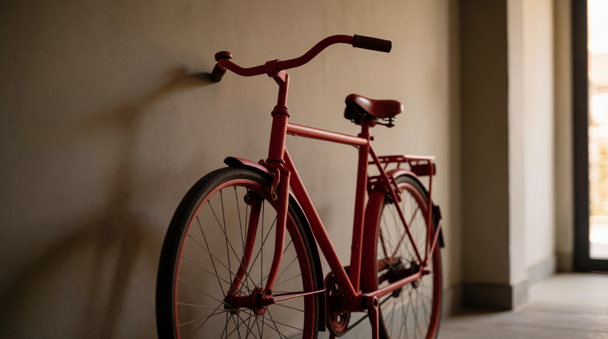 | 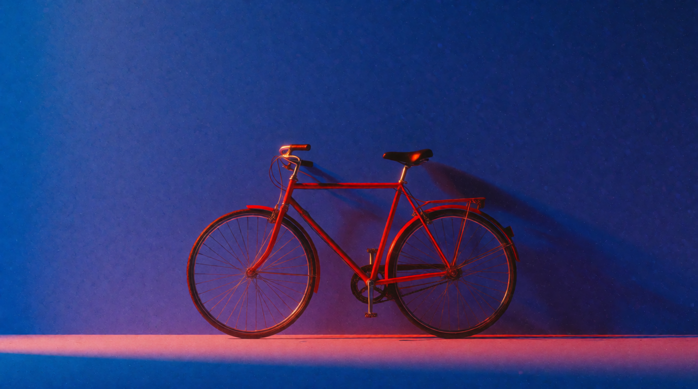 | 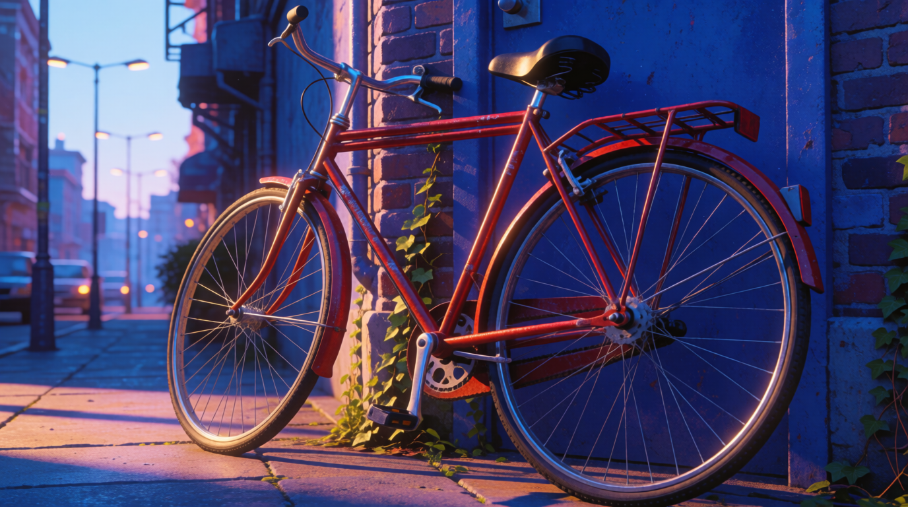 | 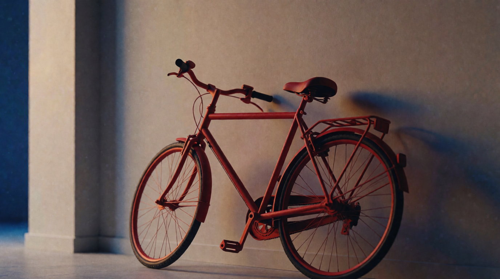 |

D sends A's native prompt expansion into B Moodboards T2I. B, starting from the short prompt, produces a minimalist cobalt-blue and red background. D retains the indoor wall, soft lighting, and bicycle details from A's expanded prompt, resulting in a more neutral indoor scene with weaker nocturnal moodboard colors. C carries the same moodboard into a city street scene.

Show the A Native expansion used by D (LLM seed 424242)

A red bicycle, with a matte finish and visible metal frame details, leans against a smooth, neutral-toned wall in a quiet, softly lit indoor space; the bike’s front wheel is slightly turned, its handlebars angled casually, and the rear rack and seat are clearly defined; the wall behind it is unadorned, creating a clean backdrop that emphasizes the bicycle’s form and color; ambient light casts gentle shadows along the bike’s frame and the wall, suggesting a late afternoon setting; the composition centers the bicycle slightly off-center, with a shallow depth of field blurring the background subtly to draw focus to the object’s texture and structure.

## Feature Overview

The six localized nodes and their responsibilities are:

- **Krea2 Prompt:** Places the raw main prompt in the embedded Stage 1 system-prompt input, and outputs both the merged prompt and the original main prompt.
- **Krea2 Prompt–Moodboard Compiler:** Combines the raw main prompt, the Stage 1 cleaned prompt, and moodboard metadata into the embedded Stage 2 system-prompt input.
- **Krea2 Prompt Harness:** Cleans the Stage 1 `TextGenerate` result; the original main prompt is also used as fallback text and source input.
- **Krea2 Moodboard Harness:** Cleans the Stage 2 `TextGenerate` result, uses the Stage 1 cleaned prompt as fallback, and can optionally append a style-only positive condition.
- **Krea2 Moodboard Adapter:** Converts string outputs from the external Krea Moodboard Visual Browser into compatible metadata JSON and a style-only positive condition.
- **Krea2 Resolution Selector:** Returns width and height from the aspect ratio and target megapixel value; it runs on a separate resolution branch.

The six node names, port labels, descriptions, and tooltips are supplied by the locale files.

## Plugin Processing Structure

The six nodes cover two-stage prompt-input construction and output cleanup, adaptation of moodboard browser strings, and independent resolution selection. The example workflows use ComfyUI core `TextGenerate` and Qwen3-VL to generate prompt text; the images themselves are generated by the external Krea 2 Turbo model and sampler nodes. This plugin does not provide `TextGenerate`, model weights, image samplers, a VAE, or a moodboard browser.

## Workflow Structure

The diagram below summarizes the example workflow’s node boundaries and main data flows. The cleaned Stage 1 prompt is also the Stage 2 fallback; the original main prompt remains the source ledger for Stage 2. The resolution selector is a separate branch.

  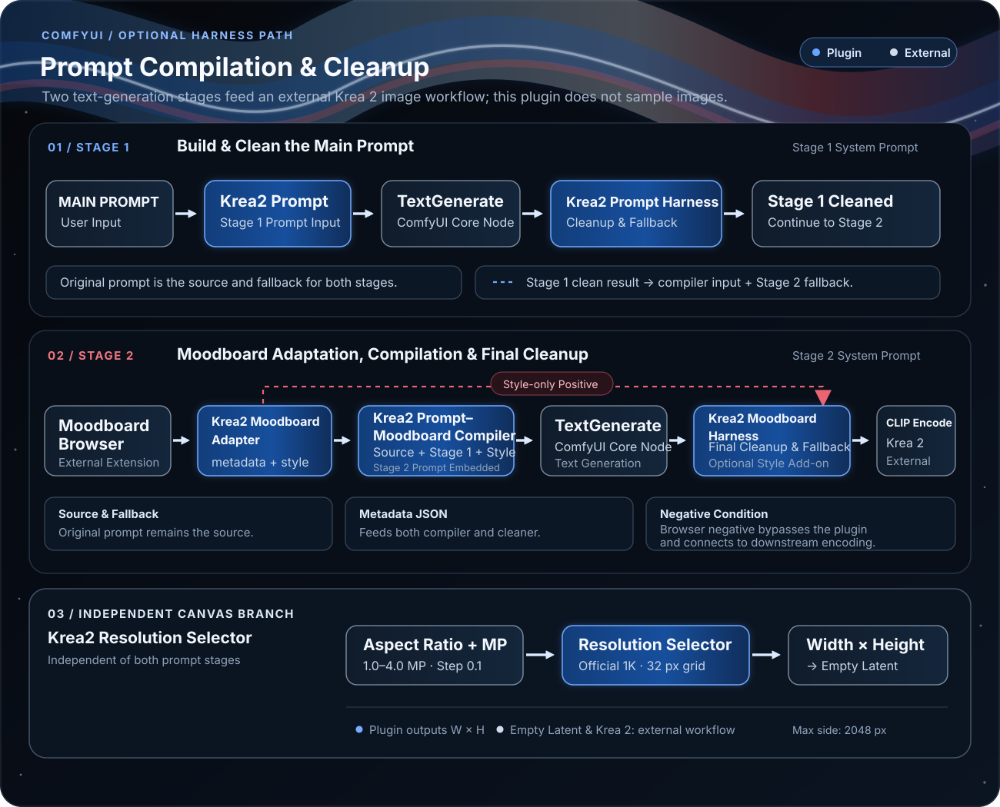

### Stage 1: Build and Clean the Main Prompt

1. Connect the original main prompt to **Krea2 Prompt**. It outputs a `Merged Prompt` containing the embedded Stage 1 role-separated system prompt, as well as the original `Main Prompt`.
2. Connect `Merged Prompt` to ComfyUI core `TextGenerate` for Stage 1. Connect the generated result and `Main Prompt` to **Krea2 Prompt Harness**.
3. Connect the **Krea2 Prompt Harness** output `Clean Prompt` to both `clean_prompt` on **Krea2 Prompt–Moodboard Compiler** and `fallback_prompt` on **Krea2 Moodboard Harness**.

### Stage 2: Compile the Moodboard and Clean the Final Prompt

1. Connect the `positive`, `title`, `uuid`, and `metadata_json` string outputs from Krea Moodboard Visual Browser to **Krea2 Moodboard Adapter**.
2. **Krea2 Moodboard Adapter** outputs `Metadata JSON` and `Style-only Positive`. If the metadata is a valid JSON object without `prompt_guidance`, the node attempts to restore that field from the browser’s `positive` output; an existing field is never overwritten. **Krea2 Prompt–Moodboard Compiler** uses an internal style adapter to organize metadata into a style channel. `Composition` is not passed to the model as a layout command; only explicit optical conditions recognized by the code are retained and converted into local optical effects. Connect the converted metadata to the compiler’s `metadata_json`, the original `Main Prompt` to `main_prompt`, and the Stage 1 `Clean Prompt` to `clean_prompt`.
3. Connect the **Krea2 Prompt–Moodboard Compiler** output to ComfyUI core `TextGenerate` for Stage 2. Connect its generated result to `prompt` on **Krea2 Moodboard Harness**. Connect the original `Main Prompt`, Stage 1 `Clean Prompt`, adapter `Metadata JSON`, and `Style-only Positive` to `original_main_prompt`, `fallback_prompt`, `metadata_json`, and `style_only_positive`, respectively.
4. **Krea2 Moodboard Harness** cleans the Stage 2 result and can optionally format and append the style-only positive condition. Connect its `Clean Prompt` to the downstream positive text encoder. The final image is generated by downstream Krea 2 and sampler nodes.

The external browser’s `negative` output does not pass through this plugin; connect it directly to the downstream negative text encoder. Connect the resolution selector’s `Width` and `Height` outputs to the size inputs of `Empty Latent Image`.

## Quick Start

### Requirements

| Component | Requirement |
| --- | --- |
| Python | 3.10 or later |
| ComfyUI | 0.3.0 or later |
| Additional Python dependencies | None |
| `TextGenerate` | The example workflows use the ComfyUI core node; use a ComfyUI build that supports the corresponding Qwen3-VL model |
| Moodboard browser | Example workflows require [ComfyUI-Krea-Moodboards](https://github.com/Andro-Meta/ComfyUI-Krea-Moodboards) |

### Installation

Clone the repository into ComfyUI’s `custom_nodes` directory:

~~~powershell
cd ComfyUI/custom_nodes
git clone https://github.com/ANe5s/ComfyUI-Krea2-Harness.git
~~~

You can also copy the `ComfyUI-Krea2-Harness` folder directly to:

~~~text
ComfyUI/custom_nodes/ComfyUI-Krea2-Harness
~~~

After installation, **fully restart ComfyUI**. Refreshing the browser page alone will not reload Python custom nodes. Once loaded, the nodes are available under:

~~~text
Nodes > ANe5s Nodes > Krea2
~~~

The minimum versions and Python dependency information above apply to **this plugin only**. The example workflows also require the Krea 2 Turbo diffusion model, Qwen3-VL text encoder, and Qwen Image VAE. Examples that use LoRAs, upscaling, or reference-image editing also require the corresponding models and extensions. Each workflow JSON contains a MarkdownNote listing model files, download links, and suggested directories. ComfyUI Desktop/Cloud may lag behind Nightly builds required by some model-node features.

The two system prompts are packaged in the code as embedded Base64 UTF-8 constants. This is only an encoding and packaging method. Both system prompts are licensed under the GNU General Public License v3.0 or later (GPL-3.0-or-later); see [LICENSE](LICENSE).

## Node Reference

The internal node types and port keys used by the current workflows are the same in the Chinese and English interfaces; localization changes only node names, descriptions, and port labels.

- **Krea2 Prompt** — Builds the Stage 1 system-prompt input and retains the original main prompt as an output.
- **Krea2 Prompt–Moodboard Compiler** — Combines the prompt and moodboard information into the Stage 2 `TextGenerate` input.
- **Krea2 Prompt Harness** — Cleans the Stage 1 `TextGenerate` result.
- **Krea2 Moodboard Harness** — Cleans the final result and can optionally append a style-only positive condition.
- **Krea2 Moodboard Adapter** — Adapts output from the external moodboard browser.
- **Krea2 Resolution Selector** — Returns width and height from the aspect ratio and target MP value.

### Prompt Construction and Cleanup

- **Krea2 Prompt** has one editable input: the original main prompt. It inserts this text into the embedded Stage 1 role-separated ChatML system prompt and also outputs the unchanged `Main Prompt` for source tracking and fallback.
- **Krea2 Prompt Harness** receives the Stage 1 generated result and the original main prompt; the original text serves as both fallback and source ledger. Refusals, protocol echoes, empty results, and some entity/medium drift trigger fallback; drift detection is heuristic. Focus protection and conditional profile-face-detail protection are disabled. Entity/medium checks (allowing medium wording in broad environment prompts) and retention of original optical anchors are fixed policies in the node.
- **Krea2 Prompt–Moodboard Compiler** receives moodboard metadata, the original main prompt, and the Stage 1 cleaned prompt. It organizes the metadata into structured style channels and combines them with the original source ledger and embedded Stage 2 system prompt to produce the `TextGenerate` input.
- **Krea2 Moodboard Harness** cleans the Stage 2 generated result, using the Stage 1 cleaned prompt as fallback and the original main prompt as the source. Its `metadata_json` input follows the existing cleaner’s `style_profile` semantics; this is a separate interface from the structured style channel that the compiler creates for `TextGenerate`. Source focus and conditional profile-face-detail protections are fixed on. The optional `style_only_positive` input is formatted and appended after a blank line.

### Moodboard Adapter

**Krea2 Moodboard Adapter** connects to these string outputs from the external Krea Moodboard Visual Browser:

- Inputs: positive condition, title, UUID, metadata JSON
- Outputs: compatible metadata JSON, style-only positive condition

`Krea2 Moodboard Adapter` handles only the browser-provided strings and JSON. It does not read card images or query or download cards. It extracts `Style-only Positive` from `positive`. If `metadata_json` is a valid JSON object without `prompt_guidance`, it attempts to restore that field from `positive`; it fills only a missing value and never overwrites an existing one. The `uuid` input is retained to match the browser’s output ports; the current adapter logic does not use it to look up a card.

The Krea2 Prompt–Moodboard Compiler has a separate internal `KreaMoodboardStyleAdapter`. It organizes metadata into structured style channels. General layout instructions in `Composition` are discarded; only explicit optical keywords recognized by the code are rewritten as local effects on existing elements. This plugin does not import or bundle the Moodboard browser, card catalog, or assets; the browser node must be provided by an external extension. The browser’s `negative` output does not pass through this plugin and should connect directly to the downstream negative input.

## Krea2 Resolution Selector

**Krea2 Resolution Selector** uses the aspect ratios and 1K base-resolution options provided natively by the official Krea 2 Turbo website. At a target of 1.0 megapixel, the node returns the corresponding base size:

| Aspect ratio | Resolution |
| --- | --- |
| 1:1 | 1024 × 1024 |
| 4:3 | 1184 × 896 |
| 3:2 | 1248 × 832 |
| 16:9 | 1376 × 768 |
| 2.35:1 | 1568 × 672 |
| 4:5 | 928 × 1152 |
| 2:3 | 832 × 1248 |
| 9:16 | 768 × 1376 |

The target megapixel input ranges from 1.0 to 4.0 in increments of 0.1. Above 1.0, the node scales the selected aspect ratio and aligns width and height to a 32 px grid; neither side exceeds 2048 px. At the side-length limit, the final pixel count may be below the target. Connect the width and height outputs to the corresponding size inputs of `Empty Latent Image`.

## Example Workflows

Drag a JSON file onto the ComfyUI canvas. Chinese and English workflows are included in the `examples` directory:

- **Text-to-image: Default** — [Chinese workflow](examples/krea2_harness_文生图默认_ZH.json) · [English workflow](examples/krea2_harness_T2I_Default_EN.json)
- **Text-to-image: Two-pass Upscale** — [Chinese workflow](examples/krea2_harness_文生图二次采样放大_ZH.json) · [English workflow](examples/krea2_harness_T2I_Upscale_EN.json)
- **Image-to-image: Default** — [Chinese workflow](examples/Krea2_Harness_图生图默认_ZH.json) · [English workflow](examples/Krea2_Harness_I2I_Default_EN.json)

| Workflow | Additional dependencies |
| --- | --- |
| Text-to-image | Krea Moodboard Visual Browser, Krea 2 Turbo diffusion model, Qwen3-VL text encoder, and Qwen Image VAE; the LoRA branch can be toggled in the graph |
| Two-pass upscale | Text-to-image dependencies plus the upscaler model referenced by the workflow (the example uses `4xFFHQDAT.pth`) |
| Reference-image editing | Text-to-image dependencies, [ComfyUI-Krea2Edit](https://github.com/lbouaraba/comfyui-krea2edit), and the identity-editing LoRA referenced by the workflow |

Each workflow’s MarkdownNote lists model download links and directories. The `LoadImage` node in the reference-image editing example does not include an image in the JSON; after importing, select the scene image and identity reference image again in the node. If a loader reports a missing model, select a compatible weight already installed on your machine.

## FAQ

**The nodes do not appear.**  
Fully restart ComfyUI and check the startup log for custom-node import errors.

**No moodboard cards are available in the workflow.**  
This plugin only adapts browser outputs; it does not include the card catalog or browser interface. Install a compatible Krea Moodboard Visual Browser separately, then connect its string outputs to Krea2 Moodboard Adapter.

**The resolution does not match expectations.**  
Check the selected aspect ratio and connect this node’s width and height outputs to the size inputs of `Empty Latent`. The node follows the 32 px grid and the 2048 px maximum side length.

## Localization and Internal Types

Localization files are located at:

- `locales/en/main.json`
- `locales/en/nodeDefs.json`
- `locales/zh/main.json`
- `locales/zh/nodeDefs.json`

Localization changes only interface text; internal node types, input keys, and output keys remain stable.

## Project Scope and License

This plugin does not include Qwen3-VL or Krea 2 model weights, image samplers, or training code.

The workflows in this README document how to connect the current plugin nodes; the generated examples demonstrate image-generation results.

This project is licensed under the GNU General Public License v3.0 or later (GPL-3.0-or-later). See [LICENSE](LICENSE) for the license text and [CHANGELOG.md](CHANGELOG.md) for version changes.

## Feedback

If you encounter plugin-loading or workflow issues, first check your ComfyUI version and confirm that the dependency nodes and models are installed correctly. Then open a [GitHub Issue](https://github.com/ANe5s/ComfyUI-Krea2-Harness/issues) with the relevant startup log or workflow screenshot.
