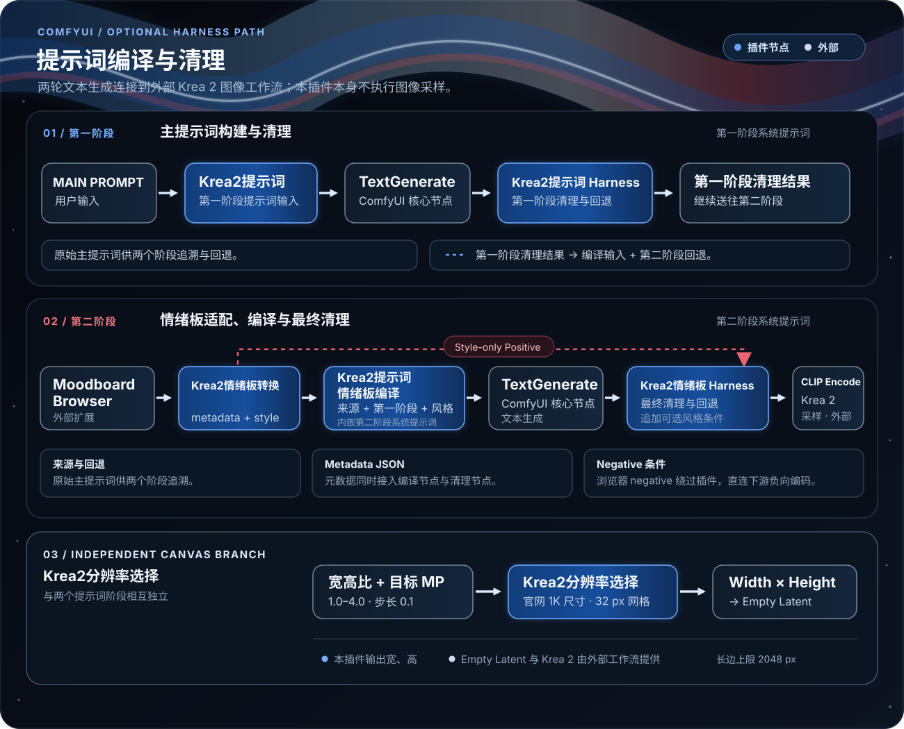

  

  
  
  
  

<a href="README.md">English</a> · 简体中文

# ComfyUI-Krea2-Harness

**ComfyUI-Krea2-Harness**是我的System Prompt Evolution (SPE，系统提示词演化 )、相关Evolution 技术研究实践的早期验证实验项目，我将其验证后的项目成果封装为可在 ComfyUI 中使用的自定义节点插件 。 &#x20;

> <small>在这条实验线上，主提示词生成所用的 System Prompt 共演化了 262 个版本，我选择第 257 版；情绪词处理所用的 System Prompt 共演化了 133 个版本，我选择第 127 版进行修订。</small>
>
> <small>其中不提供 关于我 SPE 与 Evolution 相关研究资料、技术、演化方式等，研究仍处于早期阶段。如果你正在罕见病方向开展研究（例如通过使用人类基因大模型研究），有所需要 ，欢迎与我联系  。</small>

在 Krea2 Harness 中，一段简短的提示词、一个你喜欢的情绪板样式、一个美学 LoRA，即可激发你无限的创造力。无需担心其它 Agent 给你的提示词是否与模型对齐，输入就好；简单或详细的提示词，它都能胜任。

> <small>从生成结果来看，SPE 和 Harness 不断拓宽着 CLIP 模型的能力边界；演化中自然赋予了其减少拒绝的能力（请遵守当地法律使用）。它很快，原生 4B LLM 的推理速度，胜任着更大模型完成的事。唯独一个缺陷，背景场景细化是明确的模型能力边界问题，我将其开放，不做过多细化，供你或 Agent 详细填写。</small>

### Evolution（演化）是什么

此处我可以阐述并做出正式定义， Evolution （中文名：演化）是什么，明确的说任何于大模型 输入>QKV>FFN 中于输入一端的迭代、优化等等行为你都可以广泛的称呼其为Evolution，与其对应的是模型训练，能力对齐。

[生图效果展示](#生图效果展示) · [情绪版测试](#情绪版测试) · [插件处理结构](#插件处理结构) · [工作流结构示意](#工作流结构示意) · [快速开始](#快速开始) · [节点参考](#节点参考) · [示例工作流](#示例工作流)

- **当前版本：** 0.1.0a1（V0.1 Alpha）
- **节点类别：** 节点 → ANe5s节点 → Krea2
- **运行时依赖：** 无额外 Python 依赖
- **情绪板浏览器：** 示例工作流需要另行安装 [ComfyUI-Krea-Moodboards](https://github.com/Andro-Meta/ComfyUI-Krea-Moodboards)

## 生图效果展示

### 抽象蓝银光束 · 封面 · M87 LoRA、realism\_engine\_krea2\_v3.1 Lora

提示词：一道抽象的光束蜿蜒曲折横着穿过画面中心，流动感，概念图。（选择Moodboards的Analog Cobalt Nocturne样式）封面展示此生成结果。

| 生成结果 1 | 生成结果 2 |
| --- | --- |
|  |  |

展开查看其他提示词与生成结果

### 古风女性肖像 · M87 LoRA

提示词：一个性冷淡风格、纯欲面容的 18 岁古风女性，她微笑看向镜头，手带起衣袖在风中飘动，写真，低角度镜头。（选择Moodboards的Cinematic Nocturnal Noir样式）

| M87 LoRA 0.8 | M87 LoRA 1.0 |
| --- | --- |
|  |  |

### 古风女剑仙 · M87 LoRA、realism\_engine\_krea2\_v3.1 Lora

提示词：一位白衣古风女剑仙舞剑，衣服和头发随风飘动，超低角度仰视。

| 生成结果 1 | 生成结果 2 |
| --- | --- |
|  |  |

### 赛博朋克摩托追逐 · M87 LoRA、realism\_engine\_krea2\_v3.1 Lora

提示词：一位亚裔女性骑着摩托穿行于赛博朋克都市，在超过左侧汽车的瞬间回头大笑，远处车辆爆炸；厚涂漫画风格、复杂笔触、鱼眼超广角。（选择Moodboards的Dynamic Ink Fantasy样式）

### 四象限分镜 · M87 LoRA

提示词：一个性冷淡风格，纯欲面容的18岁貌美古风女性，她微笑看向镜头，手带起衣袖在风中飘动，写真，镜头低角度

生成为四个象限的4宫格相同图片比例的分镜表，同一人物，在连贯空间中，不同角度，四个象限有大全景描述大世界的镜头、全景包含全身人物的镜头、中景镜头、特写镜头叙述连贯的故事

### 室内电影感插画 · 多情绪板样式测试 · M87 LoRA、realism\_engine\_krea2\_v3.1 Lora

## 情绪版测试

本节用同一组图像模型和采样设置，对照 ComfyUI 原生、Moodboards T2I 与 Krea2 Harness 的出图差异。验证 3 另加入 D 方案，观察将原生提示词增强文本送入 Moodboards 后的效果。

**对照方案**

- **A · ComfyUI Native：** ComfyUI 原生 Krea-2 Int8 文生图。
- **B · Moodboards T2I：** ComfyUI-Krea-Moodboards 的 krea2_visual_moodboard_t2i。
- **C · Krea2 Harness：** Krea2 Harness 的 krea2_harness_文生图默认工作流。
- **D · B Moodboards + A Native 扩写：** 仅用于验证 3；将 A 原生工作流扩写后的提示词送入 B Moodboards T2I。

**统一设置：** Krea-2 Turbo Int8、qwen3vl_4b_bf16、qwen_image_vae、Euler / simple、CFG 1.0、10 步、图像 seed 424242。A 与 C 的 LLM 采样 seed 为 424242；D 使用 A 以相同 seed 生成的扩写文本。B 的生图阶段没有 LLM 采样器。两组尺寸为 1568×672 和 1376×768。

Moodboard 样式在验证 1、2 中为 **Cinematic Nocturnal Noir — Emerald Wet Canvas**；验证 3 为 **Analog Cobalt Nocturne**。A 不使用 Moodboard。

### 验证 1 · 短提示词：创作与拓写

**输入提示词：** A library floating on the sea.  
**Moodboard：** B、C 使用 Cinematic Nocturnal Noir — Emerald Wet Canvas。

**分辨率：1568 × 672**

| A · ComfyUI Native | B · Moodboards T2I | C · Krea2 Harness |
| --- | --- | --- |
|  |  |  |

**分辨率：1376 × 768**

| A · ComfyUI Native | B · Moodboards T2I | C · Krea2 Harness |
| --- | --- | --- |
|  |  |  |

A 与 C 都生成了海上图书馆；C 进一步呈现冷青色调和湿润质感。B 的画面体现暗色冷调，但主体生成成男性近景，没有呈现图书馆。

### 验证 2 · 详细提示词：信息保留与错改

A、B、C 使用相同的详细提示词。B、C 使用 Cinematic Nocturnal Noir — Emerald Wet Canvas。

查看详细提示词

> A wide documentary photograph shows a small red wooden rowboat traveling from left to right across a calm alpine lake at dawn. The bow points right and the stern is on the left. Exactly one adult woman in a mustard-yellow raincoat sits at the stern, facing right toward the bow, and paddles with one wooden oar on the camera-facing side. A black dog sits at the bow, facing right. One folded white paper map lies on the middle bench between them. A single dark pine-covered island is centered on the horizon behind the boat. Keep the boat in the lower-right third; water fills the lower half and pale violet sky fills the upper half. No buildings, other boats, or text.

**分辨率：1568 × 672**

| A · ComfyUI Native | B · Moodboards T2I | C · Krea2 Harness |
| --- | --- | --- |
|  |  |  |

**分辨率：1376 × 768**

| A · ComfyUI Native | B · Moodboards T2I | C · Krea2 Harness |
| --- | --- | --- |
|  |  |  |

六张图都保留红木船、黄色雨衣女性、黑狗、折叠地图、松林岛和黎明湖面，没有出现其他船、建筑或文字。“船在右下三分区”的位置要求并非每张都严格实现。

### 验证 3 · Moodboards | 情绪板生效

**起始提示词：** A red bicycle rests against a wall.  
**Moodboard：** B、C、D 使用 Analog Cobalt Nocturne。A 不使用 Moodboard。

**分辨率：1568 × 672**

| A · ComfyUI Native | B · Moodboards T2I | C · Krea2 Harness | D · B Moodboards + A Expansion |
| --- | --- | --- | --- |
|  |  |  |  |

**分辨率：1376 × 768**

| A · ComfyUI Native | B · Moodboards T2I | C · Krea2 Harness | D · B Moodboards + A Expansion |
| --- | --- | --- | --- |
|  |  |  |  |

D 将 A 的原生提示词增强结果输入 B Moodboards T2I。B 使用简短输入生成钴蓝与红色的极简背景；D 保留了 A 扩写中的室内墙面、柔光和自行车细节，画面更接近中性室内场景，Moodboard 的夜景色彩表现减弱。C 则将同一 Moodboard 带入城市街景。

查看 D 使用的 A Native 扩写文本（LLM seed 424242）

A red bicycle, with a matte finish and visible metal frame details, leans against a smooth, neutral-toned wall in a quiet, softly lit indoor space; the bike’s front wheel is slightly turned, its handlebars angled casually, and the rear rack and seat are clearly defined; the wall behind it is unadorned, creating a clean backdrop that emphasizes the bicycle’s form and color; ambient light casts gentle shadows along the bike’s frame and the wall, suggesting a late afternoon setting; the composition centers the bicycle slightly off-center, with a shallow depth of field blurring the background subtly to draw focus to the object’s texture and structure.

## 功能概览

本插件的六个中文节点名及职责如下：

- **Krea2提示词：** 将原始主提示词放入内嵌第一阶段的系统提示词输入，同时输出合并后的提示词和原始主提示词。
- **Krea2提示词情绪板编译：** 将原始主提示词、第一阶段清理结果和情绪板元数据，合为内嵌第二阶段系统提示词的 `TextGenerate` 输入。
- **Krea2提示词 Harness：** 清理第一阶段 `TextGenerate` 的文本结果；原始主提示词也作为回退文本和来源输入。
- **Krea2情绪板 Harness：** 清理第二阶段 `TextGenerate` 的文本结果；使用第一阶段清理结果作回退，并可选追加仅风格正面条件。
- **Krea2情绪板转换：** 将外部 Krea Moodboard Visual Browser 的字符串输出整理为兼容元数据 JSON 和仅风格正面条件。
- **Krea2分辨率选择：** 按宽高比和目标百万像素返回宽、高；该节点属于独立分辨率支路。

六个节点的中文名称、端口标签、说明和提示均由本地化文件提供。

## 插件处理结构

六个节点覆盖两阶段提示词输入构建与输出清理、情绪板浏览器字符串适配，以及独立的分辨率选择。示例工作流使用 ComfyUI 核心 `TextGenerate` 和 Qwen3-VL 生成提示词文本；实际图像由外部 Krea 2 Turbo 模型和采样节点生成。本插件不提供 `TextGenerate`、模型权重、图像采样器、VAE 或情绪板浏览器。

## 工作流结构示意

下图概括示例工作流的节点边界与主要数据流。第一阶段清理结果还会作为第二阶段的回退提示词；原始主提示词则继续作为第二阶段的来源台账。分辨率选择器是独立支路。

  

### 第一阶段：主提示词构建与清理

1. 将原始主提示词接入 **Krea2提示词**。它输出带内嵌第一阶段的角色分离系统提示词的 `Merged Prompt`，以及原文 `Main Prompt`。
2. 将 `Merged Prompt` 连接到 ComfyUI 核心 `TextGenerate`（第一阶段）；再把生成结果和 `Main Prompt` 一起接入 **Krea2提示词 Harness**。
3. 将 **Krea2提示词 Harness** 输出的 `Clean Prompt` 同时接入 **Krea2提示词情绪板编译** 的 `clean_prompt`，以及 **Krea2情绪板 Harness** 的 `fallback_prompt`。

### 第二阶段：情绪板编译与最终清理

1. 将 Krea Moodboard Visual Browser 的 `positive`、`title`、`uuid` 和 `metadata_json` 接入 **Krea2情绪板转换**。
2. **Krea2情绪板转换**输出 `Metadata JSON` 和 `Style-only Positive`。当元数据是有效 JSON 对象且缺少 `prompt_guidance` 时，节点会尝试从浏览器的 `positive` 中恢复并补入该字段；已有字段不会被覆盖。**Krea2提示词情绪板编译**通过内部 style adapter 将元数据整理为风格通道；`Composition` 不作为布局命令传给模型，只保留代码能识别的明确光学条件并转成局部光学效果。将转换后的元数据接入编译器的 `metadata_json`，原始 `Main Prompt` 接入 `main_prompt`，第一阶段的 `Clean Prompt` 接入 `clean_prompt`。
3. 将 **Krea2提示词情绪板编译**的输出接入 ComfyUI 核心 `TextGenerate`（第二阶段）。其生成结果接入 **Krea2情绪板 Harness** 的 `prompt`；原始 `Main Prompt`、第一阶段的 `Clean Prompt`、转换节点的 `Metadata JSON` 和 `Style-only Positive` 分别接入 `original_main_prompt`、`fallback_prompt`、`metadata_json` 和 `style_only_positive`。
4. **Krea2情绪板 Harness**清理第二阶段结果，并可选地格式化后追加仅风格正面条件；将 `Clean Prompt` 接入下游正向文本编码。最终图像由下游 Krea 2 模型和采样节点生成。

外部浏览器输出的 `negative` 不经过本插件，应直接连接到下游负向文本编码。分辨率选择器输出的 `Width` 和 `Height` 则连接到 `Empty Latent Image` 的尺寸输入。

## 快速开始

### 环境要求

| 项目 | 要求 |
| --- | --- |
| Python | 3.10 或更高版本 |
| ComfyUI | 0.3.0 或更高版本 |
| 额外 Python 依赖 | 无 |
| `TextGenerate` | 示例工作流使用 ComfyUI 核心节点；需使用支持相应 Qwen3-VL 模型的 ComfyUI 构建 |
| 情绪板浏览器 | 示例工作流需要 [ComfyUI-Krea-Moodboards](https://github.com/Andro-Meta/ComfyUI-Krea-Moodboards) |

### 安装

将仓库克隆到 ComfyUI 的 `custom_nodes` 目录：

~~~powershell
cd ComfyUI/custom_nodes
git clone https://github.com/ANe5s/ComfyUI-Krea2-Harness.git
~~~

也可以将 `ComfyUI-Krea2-Harness` 文件夹直接复制到：

~~~text
ComfyUI/custom_nodes/ComfyUI-Krea2-Harness
~~~

安装后请**完全重启 ComfyUI**。仅刷新浏览器页面不会重新加载 Python custom node。节点加载后位于：

~~~text
节点 > ANe5s节点 > Krea2
~~~

上表的最低版本和 Python 依赖描述的是**本插件**。示例工作流还需要 Krea 2 Turbo 扩散模型、Qwen3-VL 文本编码器和 Qwen Image VAE；带 LoRA、超分或参考图编辑的示例还会需要对应模型和扩展。每个 JSON 内的 MarkdownNote 列有模型文件、下载链接和建议目录。ComfyUI Desktop/Cloud 的版本节奏可能落后于某些模型节点功能所需的 Nightly 构建。

两个阶段的系统提示词以内嵌 Base64 UTF-8 常量随代码打包 ，这只是编码和打包方式， 请注意两个部分的系统提示词 采用 GNU General Public License v3.0 或更高版本（GPL-3.0-or-later），许可证文本见 [LICENSE](LICENSE)。

## 节点参考

当前工作流使用的内部节点类型与端口键在中英文界面下相同；本地化只改变节点名称、说明和端口标签。

- **Krea2提示词**（Krea2 Prompt）— 构建第一阶段系统提示词输入，并保留原始主提示词输出。
- **Krea2提示词情绪板编译**（Krea2 Prompt–Moodboard Compiler）— 将提示词与情绪板信息合为第二阶段系统提示词的 TextGenerate 输入。
- **Krea2提示词 Harness**（Krea2 Prompt Harness）— 清理第一阶段 TextGenerate 结果。
- **Krea2情绪板 Harness**（Krea2 Moodboard Harness）— 清理最终结果，可选追加仅风格正面条件。
- **Krea2情绪板转换**（Krea2 Moodboard Adapter）— 适配外部情绪板浏览器输出。
- **Krea2分辨率选择**（Krea2 Resolution Selector）— 按宽高比和目标 MP 返回宽、高。

### 提示词构建与清理

- **Krea2提示词**只有一个可编辑输入：原始主提示词。它将该文本放入内嵌的第一阶段角色分离式 ChatML 系统提示词中，并另外原样输出 `Main Prompt`，供后续节点登记来源和回退。
- **Krea2提示词 Harness**接收第一阶段生成结果和原始主提示词；原文同时作为回退文本和来源台账。拒答、协议回显、空结果及部分实体/媒介漂移会触发回退，漂移判断基于启发式规则。焦点与条件式侧脸面部细节保护关闭；实体/媒介检查（允许宽泛环境中的媒介措辞）和原始光学锚点保留等策略由节点固定。
- **Krea2提示词情绪板编译**接收情绪板元数据、原始主提示词和第一阶段清理结果；将元数据整理为结构化风格通道，并与原始来源台账及内嵌第二阶段系统提示词组合为 `TextGenerate` 输入。
- **Krea2情绪板 Harness**清理第二阶段生成结果；第一阶段清理结果作为回退输入，原始主提示词作为来源。它接收的 `metadata_json` 按现有清理器的 `style_profile` 语义使用；这与编译器为 TextGenerate 生成的结构化风格通道是两个接口。节点固定开启来源焦点和条件式侧脸细节保护；可选 `style_only_positive` 经格式化后以空行分隔追加。

### 情绪板适配器

**Krea2情绪板转换**连接外部 Krea Moodboard Visual Browser 的以下字符串输出：

- 输入：正面条件、标题、UUID、元数据 JSON
- 输出：兼容的元数据 JSON、仅风格正面条件

`Krea2情绪板转换` 只处理浏览器提供的字符串和 JSON，不读取卡片图像，也不负责查询或下载卡片。它会从 `positive` 整理出 `Style-only Positive`；若 `metadata_json` 是有效 JSON 对象且没有 `prompt_guidance`，则尝试从 `positive` 恢复该字段，只补缺失值，不覆盖已有内容。`uuid` 输入是为适配浏览器输出端口保留的；当前转换逻辑不使用它查询卡片。

Krea2提示词情绪板编译另有内部的 `KreaMoodboardStyleAdapter`：它把元数据整理为结构化风格通道；`Composition` 中一般的布局指令会被丢弃，只有代码能识别的明确光学关键词会改写成作用于现有元素的局部效果。插件不导入或打包 Moodboard 浏览器、卡片目录或素材，浏览器节点需由外部扩展提供。浏览器的 `negative` 输出不经过本插件，应直接连接到下游负向输入。

## Krea2分辨率选择

**Krea2分辨率选择**使用 Krea 2 Turbo 官方网站原生提供的宽高比和 1K 基础分辨率选项。目标百万像素为 1.0 时，节点返回对应的基础尺寸：

| 宽高比 | 分辨率 |
| --- | --- |
| 1:1 | 1024 × 1024 |
| 4:3 | 1184 × 896 |
| 3:2 | 1248 × 832 |
| 16:9 | 1376 × 768 |
| 2.35:1 | 1568 × 672 |
| 4:5 | 928 × 1152 |
| 2:3 | 832 × 1248 |
| 9:16 | 768 × 1376 |

目标百万像素输入范围为 1.0–4.0，步长为 0.1。大于 1.0 时，节点按所选宽高比缩放并将宽、高对齐到 32 px 网格；任一边不超过 2048 px。达到边长上限时，最终像素数可能低于目标值。将宽、高输出连接到 Empty Latent 节点对应的尺寸输入。

## 示例工作流

将 JSON 文件拖入 ComfyUI 画布。中文与英文工作流均包含在 `examples` 目录中：

- **文生图：默认** — [中文工作流](examples/krea2_harness_文生图默认_ZH.json) · [English workflow](examples/krea2_harness_T2I_Default_EN.json)
- **文生图：二次采样放大** — [中文工作流](examples/krea2_harness_文生图二次采样放大_ZH.json) · [English workflow](examples/krea2_harness_T2I_Upscale_EN.json)
- **图生图：默认** — [中文工作流](examples/Krea2_Harness_图生图默认_ZH.json) · [English workflow](examples/Krea2_Harness_I2I_Default_EN.json)

| 工作流 | 额外依赖 |
| --- | --- |
| 文生图 | Krea Moodboard Visual Browser、Krea 2 Turbo 扩散模型、Qwen3-VL 文本编码器和 Qwen Image VAE；LoRA 分支可在图中切换 |
| 二次采样放大 | 文生图依赖，以及工作流引用的超分模型（示例为 `4xFFHQDAT.pth`） |
| 参考图编辑 | 文生图依赖、[ComfyUI-Krea2Edit](https://github.com/lbouaraba/comfyui-krea2edit) 和工作流引用的身份编辑 LoRA |

每份工作流内的 MarkdownNote 都列出对应模型下载链接与目录。参考图编辑示例中的 `LoadImage` 图片不会随 JSON 打包；导入后请在节点中重新选择场景图和人物身份参考图。节点显示模型缺失时，请在加载器中选择本机已安装的兼容权重。

## 常见问题

**节点没有出现？**  
完全重启 ComfyUI，并检查启动日志中的 custom node 导入错误。

**情绪板工作流没有可选卡片？**  
本插件只适配浏览器输出，不包含卡片目录或浏览器界面。请另行安装兼容的 Krea Moodboard Visual Browser，再将它的字符串输出连接到 Krea2情绪板转换。

**分辨率与预期不一致？**  
确认宽高比选择正确，并将本节点的宽度、高度输出连接到 Empty Latent 的尺寸端口。节点遵守 32 px 网格和 2048 px 长边上限。

## 本地化与内部类型

本地化文件位于：

- `locales/en/main.json`
- `locales/en/nodeDefs.json`
- `locales/zh/main.json`
- `locales/zh/nodeDefs.json`

本地化只更改界面文字；内部节点类型、输入键和输出键保持稳定。

## 项目范围与许可证

本插件不包含 Qwen3-VL / Krea 2 模型权重、图像采样器或训练代码。

README 中的工作流用于说明当前插件的接线方式，生成样例用于展示生图效果。

本项目采用 GNU General Public License v3.0 或更高版本（GPL-3.0-or-later）。许可证文本见 [LICENSE](LICENSE)，版本变更见 [CHANGELOG.md](CHANGELOG.md)。

## 问题反馈

遇到插件加载或工作流问题，请先确认 ComfyUI 版本、依赖节点和模型已正确安装，再到 [GitHub Issues](https://github.com/ANe5s/ComfyUI-Krea2-Harness/issues) 提交问题，并附上相关启动日志或工作流截图。

